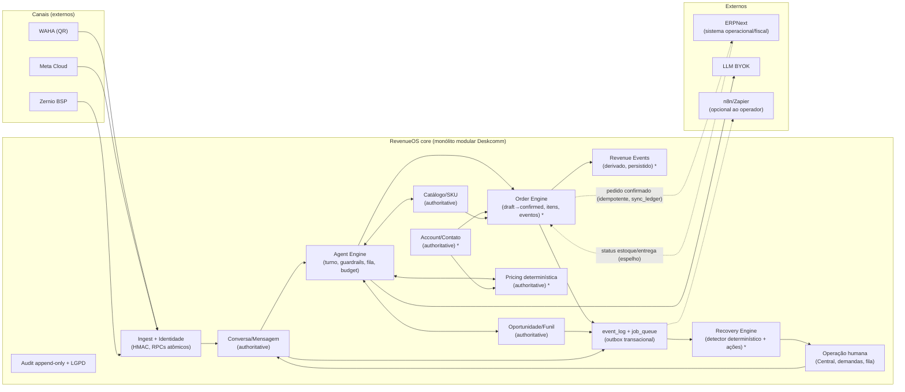

# 21 — Síntese de produto: AI Revenue Operations OS (RevenueOS)

> Esta síntese UNIFICA a auditoria da Fase 0, o pacote de decisão (doc 20), os conceitos
> do PDF de lead recovery (via briefing; arquivo ilegível no ambiente, ver evidence_note),
> os workflows provados do protótipo n8n e a arquitetura real do repo. Nada aqui modifica
> código; a Fase 1 segue o plano aprovado (ver §15 e §10).

---

## 1. Definição executiva de produto

**RevenueOS é a camada operacional de receita para negócios que vendem conversando**: um sistema que gerencia e RECUPERA receita ao longo de todo o ciclo — Conversa → Oportunidade → Cotação/Pedido → Operação/Entrega → Recuperação — com **agentes de IA que propõem e executam dentro de limites**, enquanto **a lógica determinística e o banco são a autoridade** para preço, preço por cliente, disponibilidade, totais, estado do pedido, permissões, eventos financeiros e idempotência. Não é um chatbot com CRM anexado: a conversa é a *superfície*, mas o produto é o **grafo de receita** com estado auditável, detecção de vazamento e ações de recuperação com atribuição de resultado.

**Primeiro vertical — B2B Atacado/Distribuição**: o cliente é uma EMPRESA (conta com condições, lista de preço, MOQ, prazo, rep responsável); o pedido nasce de conversa (texto hoje; voz/imagem/PDF depois), é confirmado com validação determinística, e o ERP do distribuidor continua sendo o sistema operacional/fiscal. O core é vertical-agnóstico; o B2B é o primeiro playbook (vocabulário, guardrails, regras de corte) — o mesmo core já serve os nichos atuais do Deskcomm (e-commerce, clínica, imobiliária), que continuam funcionando sem o modo B2B ligado.

**Problema que resolvemos**: no atacado, a receita não morre por falta de CRM — morre por **vazamento entre as costuras**: inquiry sem resposta, oportunidade parada, pedido pela metade, SKU indisponível sem alternativa oferecida, cliente recorrente que esfriou sem ninguém notar. Hoje isso é invisível (planilha) ou barulhento demais (automação cega). RevenueOS torna o vazamento **detectável em dinheiro**, acionável por IA com gate humano, e **atribuível** (cada recuperação carrega o evento que a originou).

**Por que é mais que chatbot/CRM/automação**: chatbot responde; CRM registra; automação dispara. RevenueOS **fecha o laço com contabilidade**: cada estado do grafo tem dono, cada vazamento tem detector determinístico, cada ação tem resultado medido, e o dinheiro (preço, total, estado) nunca é decisão de modelo — é do banco. É a diferença entre "IA que fala" e "IA que opera com o banco como árbitro".

## 2. Fronteira de produto

### CORE PLATFORM (vertical-agnóstico — vive no produto)

| Conceito | Autoridade | Base no repo (Fase 0) |
|---|---|---|
| Customer / Account / Contact | RevenueOS (banco) | `contacts` existe; **`accounts` a construir (F2)** |
| Channel Identity | RevenueOS | `contacts.wa_identity` + RPCs atômicos — pronto |
| Conversation / Message | RevenueOS | `conversations`/`messages` + ingest HMAC — pronto |
| Opportunity | RevenueOS | `crm_leads` + funil + vocabulary — pronto (ADAPT para conta B2B) |
| Product / SKU | RevenueOS | `catalog_products` — pronto (EXTEND: unidade) |
| Pricing | RevenueOS (determinística) | **a construir (F3)**; guardrail de promessa existe |
| Sales Order + Items + Events | RevenueOS (determinística) | `orders` existe (espelho, sem escritor); **engine a construir (F4)** |
| Notifications | RevenueOS | `agent_inbox_items` + web push — pronto |
| Human Handoff | RevenueOS | `force_human`/demandas/routing — pronto |
| Revenue Events | RevenueOS | **a construir (eventos de domínio de pedido)** sobre padrões existentes |
| Recovery Opportunities / Actions / Outcomes | RevenueOS | **detector a construir (F8)**; reativação de lead existe (parcial) |
| Audit / Integration | RevenueOS | `api_audit_log` append-only + `tenant_integrations` + event bus — pronto |

### VERTICAL LOGIC (B2B Distribution — knobs/templates sobre o core, não fork)

Regras de distribuição moram em **dados e configuração por vertical** (template de pipeline/vocabulário, política por conta, guardrails), nunca em código espalhado: MOQ e janela de corte (campos de conta/lista + validação no Order Engine), substituições (relação de alternativa no catálogo + comportamento conversacional do agente, que já pede confirmação em empate/ambiguidade — `lib/catalogo/busca.ts`), lista de preço por cliente (F3), disponibilidade (consulta determinística; espelho do ERP na F9), comportamento de rep (owner da conta; métricas por atendente já existem).

### INTEGRATIONS (externos, com boundary claro — §11)

ERPNext (adapter, F9) · WhatsApp/WAHA · Meta Cloud/Zernio · outros canais (rota neutra pronta; nenhum no piloto) · ERP genérico · **n8n (opcional ao operador, FORA do core — §15)** · LLM providers (BYOK).

## 3. Grafo de receita (canônico)

```
Account (autoritativo) ──< Contact ──< ChannelIdentity ──< Conversation ──< Message
   │ (condições, price_list, MOQ, rep)              │
   │                                                ▼
   │                                    Opportunity (autoritativo; crm_leads)
   │                                        │ quoted? — a COTAÇÃO é artifact da
   │                                        │ conversa, não entidade separada no MVP
   │                                        ▼
   └───────────────► SalesOrder (autoritativo; orders+order_items)
                          │◄── OrderEvent (autoritativo, append-only; lifecycle)
                          ├── OrderItem ► Product/SKU (autoritativo) ◄── PriceList/AccountPrice
                          ▼
                    Fulfillment/Delivery (DERIVADO do ERP — status espelhado)
                          ▼
                    RevenueEvent (DERIVADO de OrderEvent — persistido p/ atribuição)
                          ▼
                    RecoveryOpportunity (DERIVADO por detector determinístico)
                          ▼
                    RecoveryAction ► RecoveryOutcome (autoritativo; auditável)
```

**Autoritativo** (estado no nosso banco, escrito por fluxo validado): Account, Contact, Identity, Conversation, Message, Opportunity, Product/SKU, Pricing, SalesOrder, OrderItems, OrderEvents, RecoveryAction/Outcome, Audit.
**Derivado** (calculado/espelhado, nunca fonte): totais de pedido (calculado dos itens — DIRC), Fulfillment/Delivery (espelho do ERP), RevenueEvent (derivado e PERSISTIDO a partir de OrderEvents, porque atribuição precisa de linha imutável), RecoveryOpportunity (projeção do detector — a linha persiste, o conteúdo pode ser recomputado).
**Cotação**: no MVP, cotação é mensagem validada na conversa (preço resolvido determinístico + guardrail de promessa) — não vira entidade; se um dia virar documento (PDF de pedido), é Order em estado `draft` com render. Isto evita duplicar Oportunidade/Pedido em três objetos.

## 4. Máquinas de estado (três, deliberadamente separadas)

### A. Ciclo de Oportunidade (`crm_leads` — reuso, ADAPT mínimo)

`new → working → quoted → won | lost`
- Movido por: humano (UI), agente (tool `update_lead_state`, forward-only), automação (gatilho por etapa).
- `won`/`lost` exigem motivo (`lost_reason` CHECK já existe). `requires_human` de etapa congela agente (existe).
- **Não colapsa com Pedido**: `won` na oportunidade B2B referencia o pedido (`crm_lead_links.target_kind='order'` — o vínculo já previsto no schema e sem escritor; o Order Engine escreve). Oportunidade ganha; pedido é o instrumento.
- `stalled` não é estado — é **projeção** do detector (sem próximo passo + tempo), como o Radar faz hoje.

### B. Ciclo de Pedido (novo — Order Engine, F4)

`draft → confirmed → sync_pending → fulfilled → delivered → closed`
Com estados laterais: `cancelled`, `amended` (evento, não estado — itens de pedido confirmado nunca são UPDATEados), `sync_failed` (visível, com correção humana).
- `draft`: montado por agente ou humano; **nada vai ao ERP**; re-cotado a qualquer momento (preço/estoque consultados na hora, determinísticos).
- `confirmed`: requer validação determinística completa (itens ≥1, preço resolvido, MOQ ok, disponibilidade ok OU decisão configurável de org) + **confirmação explícita do cliente** (ou gate humano por política). Idempotência por `(org, origin, external_id)` + `Idempotency-Key`.
- Transição = `order_events` append-only no MESMO commit (outbox). Estados de sync pertencem ao `erp_sync_ledger` (F9), não à máquina comercial.

### C. Ciclo de Recuperação (novo — F8)

`detected → acted → responded → recovered | lost | expired`
- `detected`: linha criada pelo detector determinístico (cron/worker) em `revenue_opportunities` — com **valor em risco** calculado do banco, nunca pelo LLM.
- `acted`: ação executada (agente, follow-up existente, automação, ou humano) — referenciada em `recovery_actions`.
- `responded/recovered/lost/expired`: resultados medidos; `recovered` carrega a **atribuição** (order_event ou oportunidade renascida ligada por id).
- Regra Sistema Vivo: sem `acted` sem `proximo_passo` (o mesmo invariante das demandas); sem detecção sem detector — nada nasce morto.

## 5. Motor de vazamento / recuperação (tradução do "Revenue Leak Recovery Agent")

Todo vazamento segue o mesmo contrato: **trigger (estado no banco) → detection (query determinística em cron/worker) → next best action (recomendada) → execution (canal certo, com guardrails) → outcome (medido) → attribution (revenue event)**. A detecção é SQL; a IA escolhe a MELHOR ação entre as elegíveis e redige; o banco valida. Tipos (lista do briefing; PDF-NÃO-LIDO · INFERIDO do briefing):

| Tipo de vazamento | Trigger/detecção (determinística) | Next best action (típica) | Execução | Atribuição |
|---|---|---|---|---|
| Inquiry sem resposta | inbound sem resposta em X h (existe: recover-stuck é p/ envio; novo: inquiry) | responder/reativar | agente ou fila humana | revenue_event se virar pedido |
| Oportunidade parada | sem próximo passo + tempo (Radar já projeta; novo: com valor) | follow-up com ângulo específico | follow-up engine existente + agente | idem |
| Pedido abandonado | order draft sem confirmação em X h | retomar com resumo do rascunho | Order Agent (retoma draft) | order_events |
| SKU indisponível | confirmação falha por estoque | oferecer substituto ou reagendar | agente com relação de substituto (confirma) | idem |
| Conflito de preço | preço resolvido ≠ expectativa do cliente / veto de promessa | escala para humano (política) | handoff — nunca o agente decide preço | idem |
| Confirmação falha | pedido confirmado sem ack do cliente em X h | re-confirmar por outro canal/urgência | agente + Central | idem |
| Entrega falha | fulfillment_status=failed/parado (espelho ERP) | avisar cliente + abrir demanda | demandas existentes + agente | idem |
| Cliente recorrente dormente | conta com histórico sem pedido em janela (o que o radar NÃO vê hoje — não junta orders) | win-back com oferta válida | Recovery Agent + reativação | recovery_event |
| Alto valor recuperável (outros) | schema aberto: novos detectores são LINHAS de configuração, não forks | — | — | — |

Princípio: **cada detector é uma query com dono, janela e valor**; sem os três, não entra. Nada de "IA percebe que algo está errado" — o banco percebe, a IA age.

## 6. Next Best Action (NBA)

- **Recomendação (IA)**: dado o contexto da conta/pedido/vazamento, o agente PROPÕE a ação entre as elegíveis, com justificativa curta.
- **Elegibilidade (determinística)**: regras de banco decidem o que É elegível — janela de envio/pacing (existe), opt-out (existe), estado da máquina (novo: só ações válidas para o estado atual), política da conta (MOQ/crédito), budget de IA (existe). Elegibilidade NÃO é opinião do modelo.
- **Execução**: o caminho canônico já existente (single send exit + before-send + follow-up engine + demandas); pedido só via Order Engine.
- **Resultado**: outcome persistido (recovery_outcomes / order_events / atividades) — e é o que alimenta "o NBA foi bom?".
A recomendação que viola elegibilidade é vetada na execução (o guardrail já faz isso para promessas; estende-se a pedido).

## 7. Agentes de IA (inteligência, nunca autoridade)

| Agente | Propósito | Entradas | Ações permitidas | Requer validação determinística | Escala para humano quando |
|---|---|---|---|---|---|
| **Customer/Sales Agent** (existe: rag_bot) | atender, qualificar, mover oportunidade, cotar | contexto lead+conta, RAG, catálogo (tool), histórico | conversar, mover funil (forward-only), agendar follow-up, salvar notas | **cotação**: preço SEMPRE via tool de resolução (F3); promessa vigiada pela promise-table | pedido de humano, opt-out ambíguo, sentimento<0,3, jurídico, orçamento |
| **Order Agent** (F5, sobre Order Engine) | capturar pedido da conversa | catálogo, conta+preço, rascunho anterior, mensagem atual | montar rascunho, perguntar faltantes, enviar resumo, retomar draft | **confirmar pedido** só com itens/preço/MOQ/total validados no banco + confirmação do cliente; nunca calcula total | conflito de preço, item ambíguo após esclarecimento,MOQ não atendido sem política, cliente hesita |
| **Recovery Agent** (F8) | executar ações de recuperação aprovadas | recovery_opportunity + contexto da conta | redigir/reativar (follow-up engine), propor ângulo | oferta exige preço válido; janela/frequência via knobs; opt-out absoluto | cliente responde com objeção comercial, vazamento de alto valor sem ação elegível |
| **Operator/Handoff Agent** (existe: operator_turn + demandas) | back-office: abrir caso, resumir, dar próximo passo | turno+checkpoint, demandas | abrir/fechar demanda, atualizar caso, notificar | estado de demanda no banco | nunca é obrigado a decidir sozinho (dono sempre presente — invariante demandas) |

Regra transversal (já arquitetada): envio só pelo harness (`send_message` + before-send), tools MCP com escopo de funil/token efêmero, budget por org, handoff é terminal para a IA.

## 8. Mapa RevenueOS → Deskcomm (reuso antes de rebuild)

| Conceito RevenueOS | No Deskcomm hoje | Veredito |
|---|---|---|
| Conversa/Mensagem/Identidade/Handoff/Notificações/Audit/Bus de eventos/Fila | docs 01-02 — completos e vigiados | **REUSAR AS-IS** |
| Opportunity | `crm_leads` + funil + vocabulary | **REUSAR** (+ vínculo order via `crm_lead_links`) |
| Product/SKU | `catalog_products` + busca token-wise | **REUSAR** (+ `unidade`, substitutos) |
| Pricing | promise-table (guardrail) | **BUILD** (F3) + ADAPT guardrail p/ política por conta |
| Account | `contacts` é pessoa física | **BUILD** (F2: `accounts` + `contacts.account_id`) |
| Sales Order | `orders` sem escritor | **BUILD engine + ADAPT tabela** (decisão D3 aprovada) |
| Revenue Event / Recovery | radar (temperatura), reativação | **BUILD detector+ledger** (F8) reusando follow-up/demandas |
| Multimodal | derive worker (whisper/vision/pdf) | **ADAPT** na fase multimodal |
| ERP | `tenant_integrations` antecipa providers | **BUILD adapter** (F9, doc 10) |
| LGPD/tenancy/segurança | completos | **REUSAR AS-IS** (Fase 1 endurece fundação) |

## 9. Protótipo n8n — o que entra como referência

Do doc 11 (invariantes traduzidos): resolver cliente, criar pedido, lifecycle, emenda, idempotência, notificação, handoff, retry/ledger — já mapeados; 6/11 existem melhor em código. Do PDF extraído ("n8n AI Sales System.pdf" — protótipo de captação/outreach, evidência de workflow e não spec): **form de captação → identidade (nome/email/telefone) → agente de pesquisa com fontes ao vivo → roteamento por serviço escolhido → e-mail de template → confirmação ao dono**. Os invariantes que isso prova e o RevenueOS herda: captação sem atrito vira registro estruturado; enriquecimento é tarefa de agente COM restrição de fonte; saída usa template (não prosa livre); o dono é SEMPRE notificado do lead novo. No Deskcomm, cada um já tem contraparte melhor (webhooks/in + mappers Respondi/RD, RAG com citações, message templates, agent_inbox_items). **n8n segue FORA do core** (§15); os workflows provados viram requisitos, nunca runtime.

## 10. Roadmap Fase 0 revisado pela síntese

A síntese **não muda a ordem** — muda o ENQUADRAMENTO: F2 Accounts, F3 Pricing, F4 Order Engine, F9 ERP Gateway são exatamente as peças do grafo de receita (§3), nessa ordem porque cada uma é pré-requisito determinístico da seguinte (pedido precisa de preço; preço precisa de conta). Ajustes de escopo que a síntese introduz: (1) **F4 já grava `revenue_events` derivados dos order_events** (tabela + escrita no mesmo commit — barato agora, impossível de reconstruir depois); (2) **F8 Recovery passa a consumir o grafo** (detector sobre orders+silêncio+conta) — inalterado em posição; (3) a COTAÇÃO não vira entidade (§3); (4) Fase 1 (fundação/segurança) continua pré-requisito e está EM ANDAMENTO (parcialmente implementada, ver §15).

## 11. Fronteira ERP

- **Nativo no RevenueOS**: conta, conversa, oportunidade, catálogo comercial, lista de preço acordada, pedido conversacional (draft→confirmed), eventos de receita, recuperação, audit.
- **Espelhado DO ERP** (nunca fonte aqui): estoque real (consulta on-demand com cache curto no piloto), status de fulfillment/entrega, fatura, dados fiscais.
- **Enviado AO ERP**: pedido confirmado (create), emendas (update), cancelamento — via adapter, idempotente, com `sync_ledger` e reconciliação.
- **Nunca duplicado sem necessidade**: cadastro fiscal, contabilidade, logística/roteirização, compra/produção, regras tributárias. Se o ERP é o sistema de registro do domínio, o RevenueOS espelha/status — a pergunta de decisão é a do §8 do pacote: "isso pertence ao registro operacional do ERP?" (DIRC do repo aplicado a arquitetura).

## 12. MVP / Piloto B2B (menor loop útil: conversa → oportunidade/pedido → operação → recuperação)

- **MUST HAVE**: contas+contatos (F2 mínima); lista de preço por conta (F3 mínima); catálogo importado (CSV, já existe); Order Engine mínima com draft→confirmed→fulfilled-manual + idempotência + eventos (F4); Order Agent com confirmação explícita (F5); fila de operação humana mínima (confirmar/marcar entregue — F7 mínima); Central/push (existe); **detector básico de 2 vazamentos: inquiry sem resposta + pedido rascunho abandonado** (baratos, só usam estados que o MVP já tem).
- **SHOULD HAVE**: dormente-recorrente (precisa de semanas de dados), substituto sugerido, rep atribuído por conta, template de onboarding B2B.
- **NOT NOW**: ERP adapter real (F9 — piloto roda com estoque=catálogo e entrega manual), recuperação de entrega falha (depende de espelho), multimodal de pedido, multicanal (Instagram/Messenger), automações de comércio, comissão/cota, crédito com scoring, fiscal/invoice.

## 13. Decisões finais e perguntas abertas

**A. Decisões finais (acumuladas de DECISIONS.md + esta síntese):** D1-D17 valem; desta síntese: (D18) Cotação não é entidade no MVP; (D19) Oportunidade, Pedido e Recuperação são três máquinas de estado distintas; (D20) detectors de vazamento são queries determinísticas com dono/janela/valor — IA nunca detecta; (D21) `revenue_events` entra no escopo da F4.

**B. Perguntas que bloqueiam implementação específica** — as cinco conhecidas (doc 11) seguem abertas e continuam bloqueando a **F4** (não a F1-F3): (1) modo de falha de MOQ; (2) comportamento de substituição; (3) chaves de identidade além de telefone; (4) modelo de preço por cliente; (5) janela de corte de pedido. Nova OPEN QUESTION desta fase: **reler "Ai lead recovery system.pdf" num ambiente com renderer/OCR** e reconciliar este documento com o conteúdo real (nada aqui depende disso para GO, mas a F8 deve ser redesenhada se o PDF trouxer tipos de vazamento ou regras de atribuição diferentes).

## 14. Arquitetura final (canônica)


\* = módulo novo (F2-F8). O banco (Postgres+RLS) é a autoridade de TUDO no core; agentes leem via tools com escopo e escrevem por fluxos validados.

## 15. Recomendação final

1. **RevenueOS é a fronteira correta de produto?** SIM — ela nomeia o que o repo já é (camada de conversa+IA) e o que falta (pedido/pricing/recuperação), sem engolir o ERP nem o nicho atual.
2. **Deskcomm continua sendo a fundação correta?** SIM — 18 subsistemas KEEP (doc 12); o grafo de receita nasce sobre event bus, guardrails, tenancy e LGPD existentes.
3. **ERPNext como adapter externo?** SIM, inalterado (doc 10; D8).
4. **n8n fora do core?** SIM, confirmado de novo — os workflows provados (doc 11 + PDF do n8n extraído) viram requisitos; o runtime não entra.
5. **A Fase 1 precisa mudar?** NÃO. Fundação de segurança (dead-letter, emissão transacional, gate org-filter, dev-fallback, rate limit de borda, CSP/HSTS, gitleaks, decisão CPF) é pré-requisito de fluxo de dinheiro exatamente como planejado. **Estado honesto: a Fase 1 foi iniciada na rodada anterior e está PARCIALMENTE implementada na árvore de trabalho (não commitada) — os 9 itens têm edições aplicadas e faltam execução de testes (a máquina não tem Node) e o relatório de conclusão (doc 22).** A retomada da Fase 1 deve começar por verificar o que já está editado antes de prosseguir.
6. **O que implementar primeiro depois desta síntese?** Concluir a Fase 1 (verificação + relatório), depois F2 Accounts — é o único passo sem dependência pendente de resposta do dono (as 5 perguntas do n8n bloqueiam F4, não F2/F3).

---

## DECISION: **GO**

(Produto, fronteira, fundação e ordem de implementação confirmados; sem necessidade de MODIFY — as divergências potenciais do PDF ilegível foram isoladas como OPEN QUESTION da F8, e as 5 regras de negócio do n8n continuam bloqueando apenas a F4.)

## STOP

Nada foi implementado nesta rodada. Nenhum código, migration ou refactor foi tocado; o único artefato é este documento.
