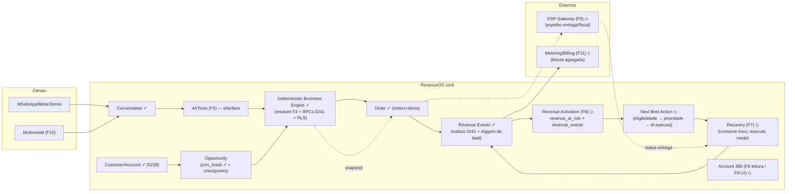

# 28 — Revenue Activation: arquitetura comercial (Fase 5.5)

## 1. Fronteira executiva de produto

RevenueOS deixa de se descrever como "assistente de vendas B2B" e passa a se medir como
**sistema operacional de receita**: cada conversa tem uma oportunidade, cada oportunidade
tem um valor e uma próxima ação, cada ação tem resultado, e o dinheiro — **em risco,
influenciado, convertido e recuperado** — é consultável por SQL determinístico e visível
ao cliente pagante. O que as Fases 2–5 construíram é o **motor** (conta → preço → pedido
→ eventos, com IA como interface); o que falta é a **camada de ativação** que transforma
esse motor em valor financeiro mensurável: detectores de vazamento, NBA, taxonomia de
eventos de receita, atribuição e a visão 360. Nada disso exige novo motor — exige
**consultas determinísticas sobre tabelas que já existem** e uma tabela derivada mínima.

**As 6 perguntas do produto, respondidas com o que existe hoje:**

| Pergunta | De onde sai (hoje ou com F6 mínima) |
|---|---|
| 1. Que receita está em risco? | Detectores SQL sobre `crm_leads`/`messages`/`orders` (§3; `crm_lead_risk_states` já detecta estagnação) |
| 2. Por quê? | O detector carrega bucket + `since`/`detected_at` + evidência (motivo legível) |
| 3. Qual a próxima ação? | Contrato NBA (§4) alimentado por `lead_checkpoints.next_action` + tipo de vazamento |
| 4. Foi executada? | `crm_lead_activities`/followup enrollment/`event_log` — ações já deixam rastro |
| 5. Criou/influenciou/recuperou? | Atribuição conservadora (§6) sobre `order_events` + eventos de ação |
| 6. O cliente vê o impacto? | Account 360 (§7) — embrião já existe em `crm-summary` |

## 2. Decisão de modelo de Oportunidade

**DECISÃO: `crm_leads` permanece o objeto canônico de oportunidade.** (Evidência: a
tabela já carrega value_cents+currency, owner+assigned_at, last_activity_at,
expected_close_date/closed_at, lost_reason, source — `baseline:1441-1466`. Criar
"opportunities" seria duplicar exatamente isso — anti-pattern 2 do CLAUDE.md.)

Mapeamento dos campos exigidos pelo produto → onde vivem (com as 3 lacunas mínimas):

| Campo da oportunidade | Onde vive | Lacuna? |
|---|---|---|
| Estado | `crm_leads.status` + `stage_id` (funil) — | não |
| Valor estimado | `value_cents` + `currency` (0208) | não |
| Source | `source` + `source_metadata` | não |
| Owner (rep) | `owner_user_id` / `owner_agent_id` + `assigned_at` | não |
| Timestamps / última atividade | `created_at`/`last_activity_at` | não |
| Motivo de perda | `lost_reason` (CHECK exige quando lost) | não |
| **Linked account** | DERIVADO: `contact_id → contacts.account_id` (0239) — join determinístico; nenhuma coluna nova | não (join) |
| **Linked conversation** | DERIVADO: contato↔conversa 1:1 nativo do WhatsApp; histórico em `crm_lead_links('conversation')` (leitura já existe no handoff) | não (join) |
| **Linked order** | `orders.account_id` (F4) — pedido é da CONTA; para oportunidade específica, `crm_lead_links('order')` existe no CHECK e fica para a F7 ligar won↔pedido | não (existe) |
| **Next action** | `lead_checkpoints.next_action` (a declaração do turno da IA já grava por contato) | não (join por contato) |
| **Action deadline** | LACUNA 1 — recomendação: reusar `followup_enrollments.next_eval_at` quando a ação é follow-up agendado (existe) e `crm_lead_reactivations.expires_at` quando é win-back (existe). Nenhuma coluna nova: o prazo É o agendamento existente | não (join) |
| Vazamento detectado | `crm_lead_risk_states` (bucket, since/detected_at, janela por estágio — **detector determinístico já em produção**) | não |
| Valor derivado de pedido | DERIVADO: `orders` da conta (origin/authority em F4) | não |

**Lacuna real mínima (para a F6)**: uma única tabela derivada **`revenue_events`** (D21)
+ persistência dos detection hits (hoje o radar calcula e descarta). Ambas aditivas,
RLS padrão, sem tocar `crm_leads`.

## 3. Revenue at Risk (detecção 100% determinística)

Cada tipo: **trigger** (estado no banco) → **eligibility** (janela/elegibilidade) →
**valor estimado** → **owner** → **deadline** → **próxima ação**. LLM nunca cria
verdade financeira; no máximo EXECUTA a ação já autorizada.

| Tipo | Trigger (SQL) | Valor estimado | Deadline | NBA típica |
|---|---|---|---|---|
| Inquiry sem resposta | inbound `messages` sem outbound subsequente > X h | `crm_leads.value_cents` da conta/contato (ou null → oportunidade nova) | X h desde o inbound | responder (agente) / fila humana |
| Oportunidade estagnada | `crm_lead_risk_states` (já detecta: bucket por janela do estágio) | `value_cents` | janela do estágio | follow-up com ângulo (motor existente) |
| Rascunho abandonado | `orders` status='draft' + `created_at` > Y h (origin='manual') | Σ linhas (snapshot) | Y h desde criação | retomar rascunho (Order Agent) |
| Sem preço / produto indisponível | recusa `no_price/produto_inativo` em turno (flag da F5) — **persistir o hit** (lacuna) | valor da linha recusada | imediato | alternativa pela busca / escalação (já mapeada) |
| Confirmação falha | rascunho confirmado pelo cliente na conversa mas sem `order.confirmed` em Z h (declaração do turno × estado) | total do rascunho | Z h | re-confirmar / operador |
| Entrega falhada | `fulfillment_status` espelhado do ERP (F9 — só existe após ERP) | total do pedido | pós-mirror | avisar cliente + demanda |
| Cliente recorrente dormente | conta com pedido confirmado há > D dias e nenhum contato desde | média dos últimos N pedidos | D dias desde o último | win-back (reusa `crm_lead_reactivations` — proto-recovery existente) |
| Outros | schema aberto de buckets em `revenue_at_risk` (tipo+evidência+valor) — novos detectores são LINHAS, não forks | — | — | — |

**Persistência (F6)**: hits gravados em `revenue_at_risk` (org, tipo, evidência, valor,
owner, deadline, estado open/acted/resolved/expired) — a linha É a Recovery Opportunity
da F7. Sem a linha, a F7 não tem o que consumir.

## 4. Next Best Action — contrato (recomendação ≠ autorização ≠ execução ≠ resultado)

1. **Elegibilidade (determinística)**: opt-out, janela/pacing, pedido/estado válidos,
   política da conta, budget — tudo já executável com primitivos existentes.
2. **Candidatos**: gerados por cada detector ativo que bateu (o bucket É o candidato).
3. **Prioridade/ordem**: fórmula explicável e documentada — severidade do tipo
   (dinheiro × urgência) > idade > valor. NADA de score opaco; a ordenação é uma
   função pura inspecionável.
4. **Recomendação (IA)**: escolhe ENTRE as elegíveis e redige a execução — nunca cria
   elegibilidade.
5. **Autorização**: já embutida (tool roles; confirmação humana B1; mutações manager+).
6. **Execução**: canais existentes — follow-up engine, demandas, tools de rascunho,
   envio único com before-send.
7. **Resultado/Outcome**: `order_events`/`crm_lead_activities`/estado da linha de risco
   (acted → responded → recovered|lost|expired) — fecha o laço do §1.

## 5. Taxonomia de eventos de receita

| Evento | Origem | Classe | Persistência |
|---|---|---|---|
| opportunity_created / progressed / won / lost | triggers de `crm_leads` (JÁ EMITEM lead.created/won/lost/stage em event_log) | **authoritative** | event_log (já existe) |
| order_created / confirmed / cancelled | outbox 0241 (JÁ EMITE order.* no mesmo commit) | **authoritative** | event_log + order_events |
| revenue_at_risk | detectores (F6) | **derived** (mas a LINHA persiste: é o contrato da F7) | `revenue_at_risk` |
| recovery_started / succeeded / failed | execução+resultado da ação (F7) | **authoritative da ação** (derivada do risco) | `revenue_at_risk` (estado) |
| revenue_influenced | atribuição (§6) na confirmação | **derived, persistida na atribuição** | `revenue_events` |
| Idempotência | `revenue_at_risk` idempotente por (org, tipo, entidade) aberto; `revenue_events` append-only com dedup por (org, fonte, external) | — | — |

**Nenhum emissor novo de event_log é necessário para F5.5** — a taxonomy consome o
outbox da F4 e os triggers de lead já existentes.

## 6. Atribuição conservadora (sem probabilidade)

- **DIRECT_REVENUE**: pedido confirmado desta org — atribuição trivial (o pedido É o
  fato). `order.confirmed` → valor = total_cents.
- **RECOVERED_REVENUE**: linha `revenue_at_risk` aberta para a conta/oportunidade cujo
  pedido foi confirmado dentro da janela da linha (detecção→confirmação), com a ação
  registrada entre os dois. O vínculo é o id da linha de risco no `order_events.payload`
  — determinístico, sem score.
- **INFLUENCED_REVENUE**: pedido confirmado onde uma ação rastreada do RevenueOS
  (follow-up enviado, rascunho criado pelo agente, reativação aceita) precedeu o pedido
  na mesma conta dentro de N dias (N=30 default, knob). Primeiro-ato-documentado, não
  modelo probabilístico.
- Tudo auditable e refutável: cada atribuição carrega os ids da cadeia
  (ação → evento → pedido).

## 7. Account 360 — contrato de dados (sem UI)

Raiz: `accounts` (F2). O embrião já roda: `crm-summary` por contato (leads, orders,
activities, demandas, notas). O contrato por conta:

```
Account (accounts)
├── contacts            (contacts.account_id)
├── conversations       (contatos da conta → conversas)
├── opportunities       (crm_leads via contact) + estado/estágio/valor
├── orders              (orders.account_id) + itens/eventos
├── revenue             (Σ orders confirmados por período — derivado)
├── revenue_at_risk     (Σ revenue_at_risk aberto + buckets)
├── recovered_revenue   (Σ linhas resolved=decoded recovered)
├── active_next_actions (NBA abertas: followups agendados, rascunhos, linhas de risco acted)
└── recovery_history    (crm_lead_reactivations + revenue_at_risk resolvidos)
```

Uma rota de leitura por conta (molde `crm-summary`) entrega este contrato na F6.

## 8. Métricas comerciais mínimas (consulta, não dashboard)

open opportunities · opportunity value (Σ value_cents abertas) · revenue at risk (Σ
aberto, por bucket) · revenue recovered (Σ resolvido→pedido confirmado) · revenue
influenced (Σ com influência) · orders created/confirmed (janela) · recovery conversion
(recovered ÷ at_risk aberto) · response time (`avg_first_response_seconds` JÁ EXISTE em
`fn_attendant_metrics`) · unresolved opportunities (abertas sem next action — o radar já
marca `sem_proximo_passo`). Todas SQL sobre tabelas existentes + as duas novas.

## 9. Valor de produto e implicações de pricing (sem promessa de número)

- **Valor mensurável**: dinheiro em risco tornado visível (antes invisível), ações
  executadas com rastro, receita recuperada com atribuição — o cliente passa a ver
  "R$ X em risco, R$ Y recuperado" em vez de "mensagens processadas".
- **Defensibilidade**: detecção determinística por vertical, motor de execução
  (follow-up+agente+pedido) fechado no mesmo sistema, trilha auditável, snapshot
  imutável de preço — concorrentes de chatbot não têm pedido nativo nem eventos.
- **Custo de troca**: catálogo + listas de preço + contas + histórico de pedidos +
  eventos de receita acumulados na instância.
- **Valor de integração**: ERP como espelho (F9) faz do RevenueOS a camada comercial
  que o ERP não tem.
- **Evidência de ROI**: os próprios contadores do produto (recuperado/influenciado/
  confirmado) — a tela de valor é a mesma do produto.
- **Dimensões futuras de billing** (§10): contas ativas, conversas, ações de IA,
  pedidos, recovery.

## 10. Contrato futuro de metering (sem implementar)

Todos os contadores já têm lar: `accounts` (ativas), `messages`/`conversations`,
`llm_calls` (ações de IA, já com custo por linha!), `orders` (processados/confirmados),
`revenue_at_risk` (oportunidades/ações), `order_events` (operações ERP futuras),
revenue recuperado (atribuição). **Nada de coluna de billing no domínio** — metering é
leitura agregada; a única disciplina é NÃO apagar histórico antes da janela de medição
(retenção existente já cobre).

## 11. Fronteira Recovery (F7)

Recovery **consome**: linhas `revenue_at_risk` (já com valor/owner/deadline/NBA),
oportunidades (`crm_leads`), pedidos (`orders`/`order_items`), atividade da conta,
e o motor de execução existente (follow-up adaptativo, reativação com expiração,
demandas, agente com tools). Recovery **NÃO cria** CRM/oportunidade/tabela de risco
paralela — o que hoje é `crm_lead_reactivations` (win-back com expiração) e
`crm_lead_risk_states` (estagnação) são os precedentes diretos dentro do mesmo banco.
F5.5 entrega o contrato; F7 entrega os executores e o laço de resultado.

## 12. Fronteira multimodal (F10)

- **Ingestão/extração (IA permitida)**: transcrever áudio, ler imagem/PDF → PROPOSTA
  de linhas (produto candidato + quantidade) — nunca verdade.
- **Normalização**: produto por `crm_search_products` (com empate/relaxamento →
  confirmação), quantidade → inteiro validado.
- **Validação determinística**: resolver F3 (preço por conta), RPCs 0241 (estado),
  same-org, idempotência.
- **Criação**: `criarRascunho` (draft) + confirmação humana (B1). A fronteira é a MESMA
  do texto — multimodal só muda como as linhas são PROPOSTAS, nunca quem decide.

## 13. Arquitetura canônica (autoritativo ✓ vs derivado ◇)


✓ autoritativo (banco) · ◇ derivado/consultável. IA aparece APENAS em AG.

## 14. Roadmap revisado (por dependência, não por feature count)

| Fase | Conteúdo | Por quê AGORA |
|---|---|---|
| **F6 — Revenue Activation foundation** | `revenue_at_risk` + `revenue_events` (D21) + detectores determinísticos + rota Account 360 (leitura) | Fecha o laço de valor sobre o motor F2-F5; é pré-requisito de TUDO abaixo |
| **F7 — Operator console + Account 360 UI** | confirmação/cancelamento pela tela (B1 exige humano), fila de rascunhos, visão 360 e métricas | O piloto pagante precisa CONFIRMAR e VER dinheiro — API-only não se vende |
| **F8 — Recovery Engine** | executores das linhas de risco (motor de follow-up/reativação) + laço de resultado | Consome F6; sem F6 não há o que recuperar |
| **F9 — ERP Gateway** | ERPNext adapter + sync_ledger + espelho de entrega | Entrega/fulfillment real alimenta detectores (entrega falhada) e fecha a operação |
| **F10 — Multimodal ordering** | proposta de linhas por voz/imagem/PDF | Depois que o loop de texto→dinheiro medir valor |
| **F11 — Metering/Billing** | leitura agregada dos contadores (§10) | Comercializa quando o piloto validar |
| **F12 — Hardening + piloto** | retenção de order_events, SLO, ensaio de update VPS | Antes do primeiro cliente pagante |

**Mudança vs roadmap antigo (doc 16)**: multimodal DESCE (texto já fecha dinheiro);
Account 360/UI SOBE e se funde com o console de operação (visibilidade É valor);
Recovery vem logo após a ativação (consome direto); metering vira fase própria.

## 15. MVP — o menor produto vendável B2B (loop fechado de dinheiro)

**Já existe (F1–F5)**: conversa → conta → preço determinístico → rascunho de pedido
idempotente → eventos no commit → tools de agente com fronteira de segurança.
**Falta para vender (F6+F7 mínimos)**: detectores persistidos + `revenue_events` +
**confirmação pela tela** + visão 360/métricas mínimas + 1 detector de recovery
(dormente + rascunho abandonado) executado pelo motor de follow-up.
**Fora**: ERP, multimodal, dashboards avançados, billing, forecasting.

Loop fechado do MVP: mensagem → oportunidade/pedido → execução determinística → evento
de receita → visibilidade (360/métricas) → vazamento detectado → ação → resultado
medido. Com isso, a conversa de venda do piloto gera: pedido confirmado, receita
atribuída, vazamento visível em dinheiro e recuperação medida — o produto se justifica
pelo próprio relatório.

## 16. Decisões de negócio em aberto (não inventadas)

1. **Janelas dos detectores** (X h sem resposta, Y h de rascunho, D dias de dormência) — knobs por org, defaults propostos no doc, decisão do dono antes da F6.
2. **Atribuição INFLUENCED**: janela N=30 dias e quais ações contam — decisão de produto.
3. **A quem pertence a linha de risco** (rep da conta? owner do lead? fila?) — depende de como o piloto organiza o time.
4. **Moeda de consolidação de métricas** (doc 17 Q3) — segue aberto.
5. **Critérios de credit/approval** (doc 25 B5) — antes da F7 confirmar pedidos grandes.

## 17. Explicitamente NÃO construir (agora ou nunca)

Nunca: segundo modelo de oportunidade · score/opacidade de prioridade · atribuição
probabilística · billing no domínio · IA como autoridade financeira · detecção por
"intuição" de LLM · warehouse de analytics · dashboards nesta fase.

---

## DECISION: **GO**

A síntese valida a evolução: o motor já existe (F1–F5) e a ativação é uma camada
**derivada e aditiva** (2 tabelas + detectores SQL + contratos de leitura) sobre
primitivos que já rodam — `crm_leads` permanece canônico, `crm_lead_risk_states`/
`reactivations`/`checkpoints` são os precedentes internos, e nenhum evento novo precisa
de emissor (o outbox da F4 e os triggers de lead já os produzem). Próximo passo
recomendado: F6 Revenue Activation foundation.

## STOP

Nenhum código, migration, commit ou push nesta fase.
